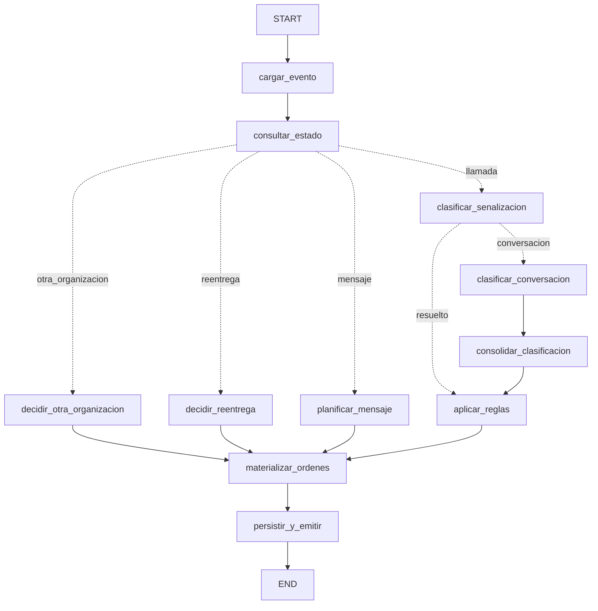

# Orquestador post-llamada · Kontaktu

Recibe **un evento** (`call.ended` o `message.received`), decide **una etiqueta** y emite las
**órdenes al CRM** que procedan. Python + LangGraph, estado entre procesos en SQLite.

## Cómo se ejecuta

```bash
python -m venv .venv && .venv/Scripts/activate        # Linux/macOS: source .venv/bin/activate
pip install -r requirements.txt
cp .env.example .env                                   # OPENAI_API_KEY y MODELO (opcional)

python run.py eventos/01-call-ended-nuria.json         # un evento → append en salida/*.jsonl
python procesar_lote.py                                # lote completo desde cero, un proceso por evento
python verificacion/verificar.py                       # verificación de extremo a extremo
```

Código de salida: `0` procesado · `2` evento inválido · `1` error interno. El estado vive en
`estado/kontaktu.sqlite3`; para empezar de cero basta con borrar `estado/` y `salida/`.

**Modelo:** `gpt-4.1-mini` (cambiable con `MODELO`). La tarea del modelo es acotada: elegir una
de 10 etiquetas y extraer 4 datos de una transcripción corta en español. Un modelo pequeño
basta, es barato y rápido, admite *Structured Outputs* estrictos (no puede inventar una etiqueta
fuera del enum) y con `temperature=0` es reproducible. Un modelo de razonamiento añadiría
latencia y coste sin mejorar la clasificación.
**Sin clave**, `run.py` usa automáticamente un **clasificador simulado** (reglas sobre el texto)
con la misma interfaz. Sirve para probar todo el sistema sin red; la evaluación real debe
hacerse con el modelo (`MODO_CLASIFICADOR=llm`).

## Cómo está hecho



- **El modelo solo clasifica y extrae** ([prompts/](prompts/)). SIP, AMD, cita creada, otra
  organización y reentregas se deciden **sin modelo** ([senalizacion.py](orquestador/clasificacion/senalizacion.py)).
  Fechas, plazos, ventana, intentos y reglas N1–N5 son **código determinista**
  ([reglas.py](orquestador/reglas.py), [tiempo.py](orquestador/tiempo.py)).
- `consolidar_clasificacion` corrige al modelo con hechos del evento: sin cita en el CRM no puede
  haber `visita_reservada` (N5), y con cita la hay (salvo baja).
- Las dependencias se inyectan con `context_schema`/`Runtime`. El estado del grafo solo lleva
  datos. Ningún nodo escribe hasta `persistir_y_emitir`, que hace una única transacción SQLite
  y escribe los `.jsonl` dentro de ella: si algo falla, no queda nada a medias (R8).
- No uso checkpointer de LangGraph: lo que hay que recordar entre procesos es estado de negocio
  por lead (intentos, recordatorios, bajas), no el de una ejecución. Va en tablas propias
  ([persistencia.py](orquestador/persistencia.py)).
- Idempotencia (R5) en dos barreras: el hecho (`idempotency_key` del evento ya procesado) y cada
  orden (`idempotency_key` UNIQUE). Los `orden_id`/`reminder_id` son `sha1` de la clave, el
  mismo formato que el ejemplo resuelto (`ord_96decc21`).

Cada decisión interpretativa, con su fuente y su porqué, está en **[DECISIONES.md](DECISIONES.md)**.

## Qué dejé fuera y por qué

- **Festivos**: `campana.yaml` no los declara; inventarlos sería peor que ignorarlos.
- **Atomicidad fichero + SQLite**: no comparten transacción. Si el proceso muere justo entre
  escribir el `.jsonl` y el `COMMIT`, una reentrega duplicaría líneas. La ventana es de
  microsegundos y cerrarla exigiría deduplicar leyendo la salida en cada ejecución.
- **Concurrencia**: el enunciado entrega los eventos de uno en uno. La lectura del estado no se
  bloquea frente a otro proceso simultáneo.
- **Confianza baja del modelo**: solo `otro` (y el fallo del modelo) van a revisión humana. Fijar
  un umbral sin datos reales sería arbitrario.
- **Clasificador simulado**: es frágil ante paráfrasis. Existe para verificar sin clave, no para
  producción.

## Cómo lo verifiqué

`python verificacion/verificar.py` ejecuta los lotes como en la evaluación (desde cero, un
proceso por evento) y comprueba casi 470 condiciones:

1. **Esquemas**: cada decisión contra `decision.schema.json`, y cada `cuerpo` contra el
   `requestBody` de su operación en `crm-openapi.yaml`.
2. **Invariantes**: una decisión por evento recibido; `decision.ordenes` coincide con
   `ordenes.jsonl`; ids y claves únicos; `cerrar_llamada` exactamente en cada `call.ended` propio
   procesado por primera vez; ninguna llamada fuera de la ventana.
3. **Expectativas calculadas a mano** antes de ejecutar ([escenarios.py](verificacion/escenarios.py)):
   el lote oficial y **25 eventos sintéticos** para lo que el oficial no cubre. Incluyen los casos
   ⚠ 11, 12 y 15, 5xx, IVR, sábados y domingos, límites de ventana, intentos agotados, N1–N4 con
   estado entre eventos, AMD `uncertain`, un evento inválido (R8) y reentregas.
4. **Idempotencia**: reentrego el lote oficial entero sobre el mismo estado. Cero órdenes nuevas
   y cada decisión repite su etiqueta.

También comprobé:
- **Que el verificador detecta errores**: rompí a propósito una regla (N4) y una expectativa, y
  lo marcó.
- **Que el evento 02 reproduce byte a byte** el `ejemplo-resuelto/`.
- **Que un fallo del modelo** (servidor inaccesible) acaba en `otro` con una tarea `revisar_llamada`
  y código de salida 0.

La revisión visual se hace con `visor/index.html` sobre `salida/`.

Prompts del código: [prompts/](prompts/). Prompts que di al asistente de programación (Claude
Code): [docs/prompts-asistente.md](docs/prompts-asistente.md).
